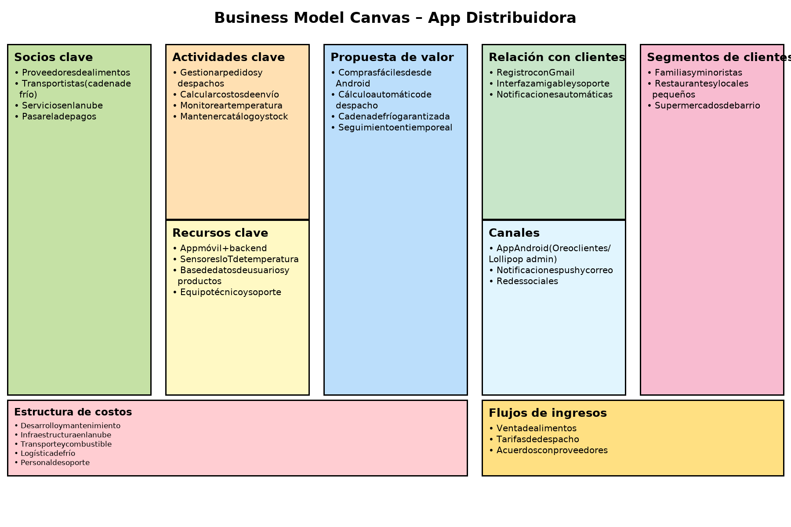
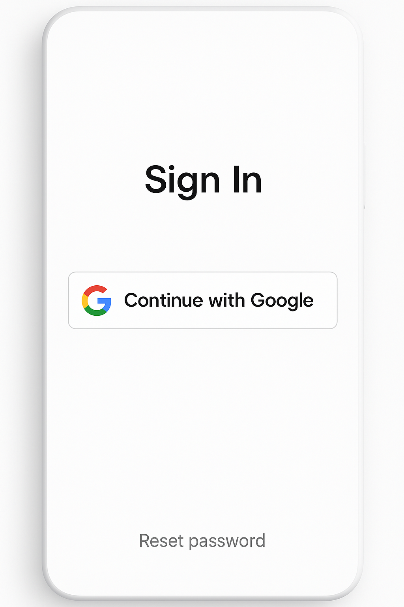
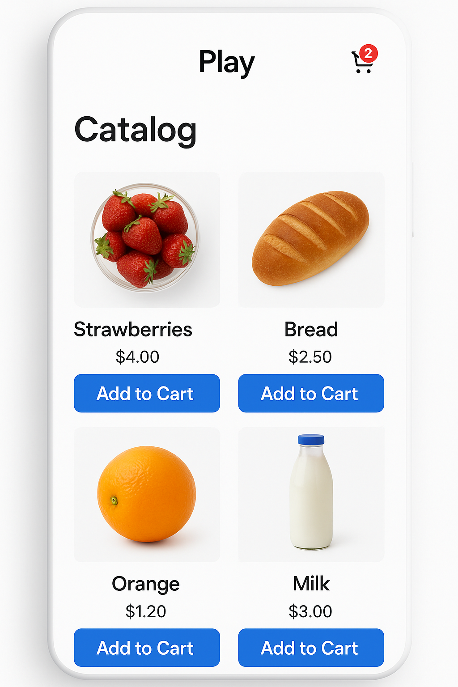
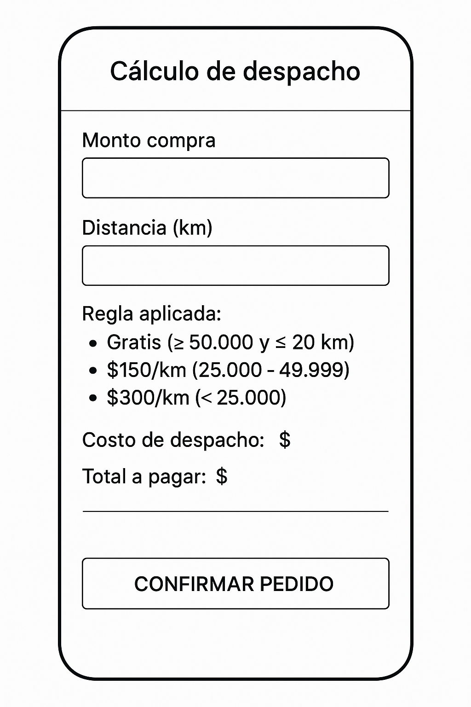
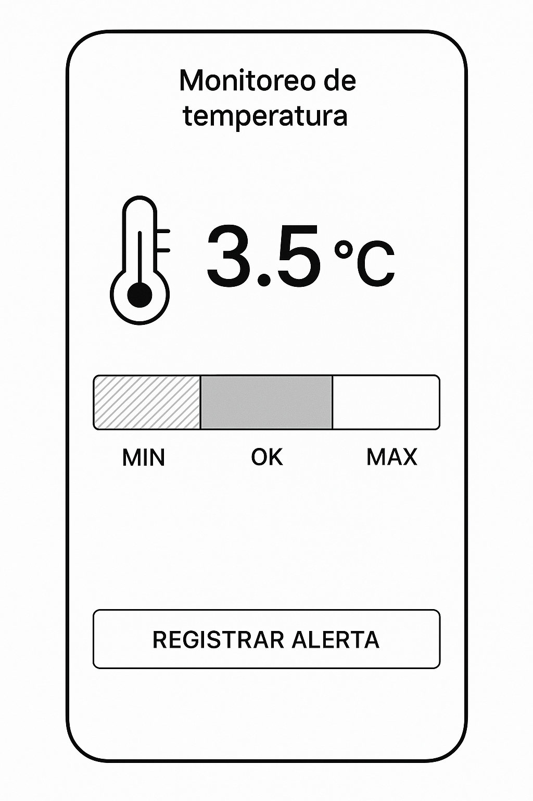
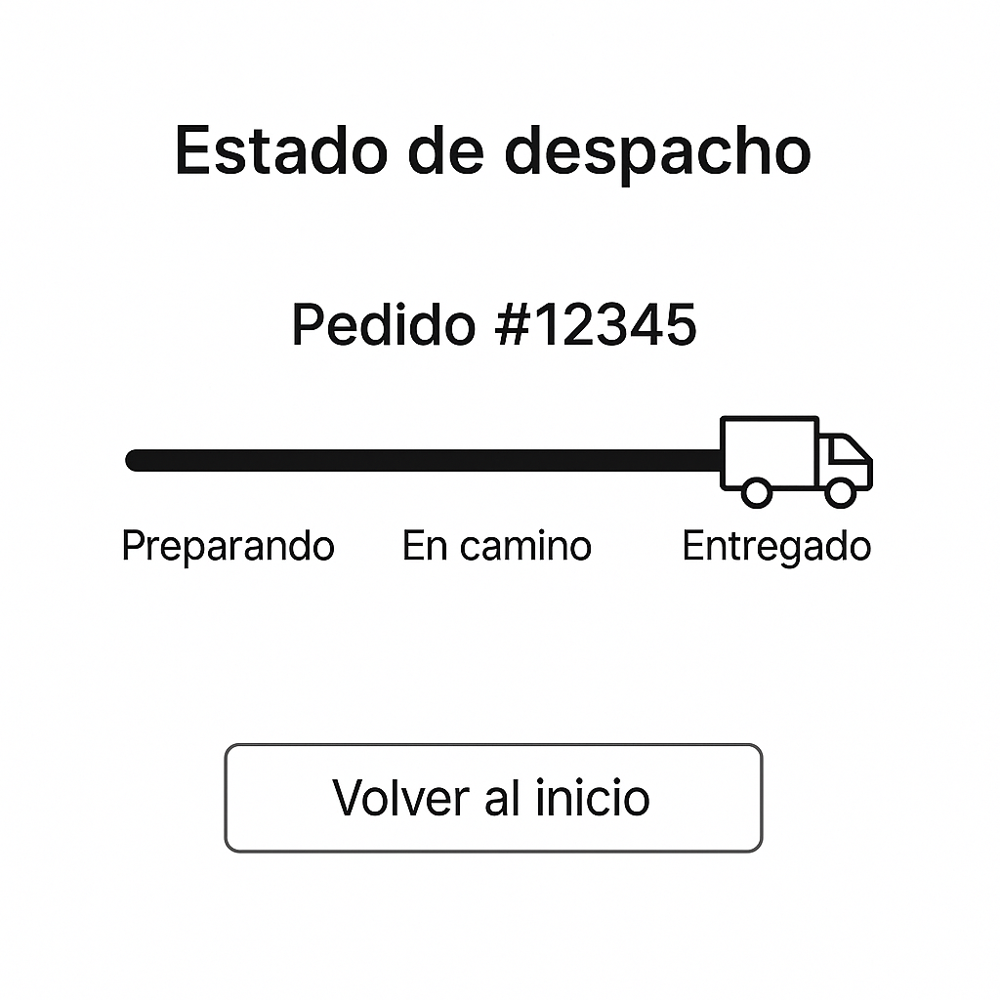

# 📱 Aplicación Móvil – Distribuidora de Alimentos

Este proyecto corresponde a la actividad de la **Semana 7** del curso *Taller de Aplicaciones Móviles*.  
Se desarrolla un **prototipo no funcional** y un **modelo Canvas** para la aplicación móvil de una distribuidora de alimentos.

---

## 📊 Modelo Canvas

---

## 🖥️ Prototipo No Funcional

El prototipo no funcional incluye las pantallas principales de la aplicación:

### 🔐 Registro / Inicio de Sesión

---

### 🛒 Catálogo de Productos

---

### 🚚 Cálculo de Despacho

---

### 🌡️ Monitoreo de Temperatura

---

### 📦 Estado del Despacho

---

## 📌 Funcionalidades Clave

- Registro de usuarios con **cuenta Gmail**.  
- **Catálogo** de productos con opción de agregar al carrito.  
- **Cálculo automático de despacho** según reglas de negocio:
  - Gratis (≥ $50.000 y ≤ 20 km).  
  - $150/km (entre $25.000 y $49.999).  
  - $300/km (< $25.000).  
- **Monitoreo de temperatura** en productos congelados, con alertas.  
- Consulta de **estado del despacho** en tiempo real.  

---

## 👨‍💻 Integrantes

- [Nombre del estudiante]  
- [Nombre del compañero si aplica]

---

## 📚 Referencias

- Osterwalder, A., & Pigneur, Y. (2010). *Business Model Generation*. John Wiley & Sons.  
- Documentación oficial de GitHub y Markdown: [https://docs.github.com](https://docs.github.com)  
